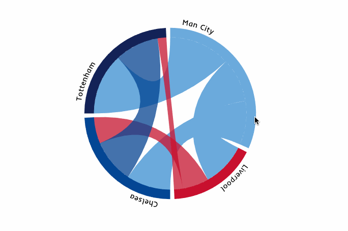
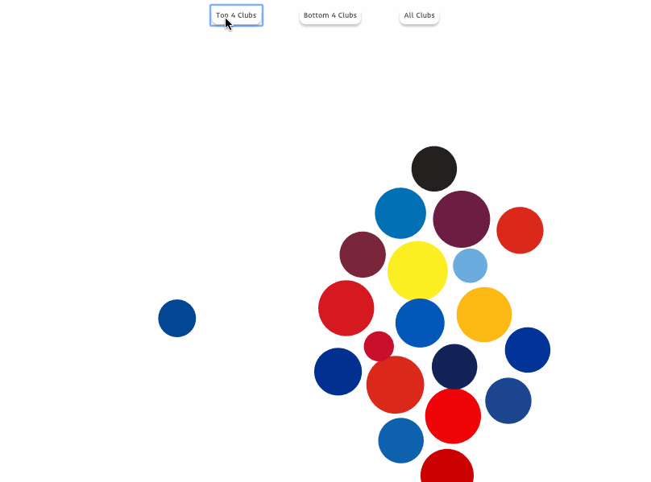
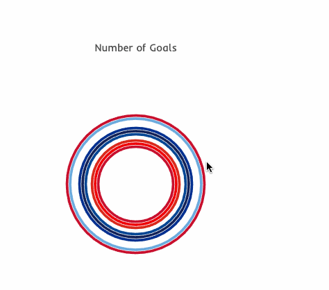

# PremierLeague-DataVisualization
## Background and Overview

The English Premier League is one of the most exciting football leagues with some of the best players in the world.
This data visualization looks at the league as a whole, total goals scored, as well as number of cards recieved throughout the 2018-19 season. 

Seeing as the top and bottom of the league are such highly contested positions (the top 4 get to participate in the Champions League the following year, and the bottom 3 are relegated to the division below), I also took a closer look at the number of cards received in matches between these teams. Is there a correlation between team standing and how many fouls there are in a match? 

Lastly, I had a look at some individual player stats, taking the top 25 goal scorers in the league. Do their values reflect goals scored? Does it impact how popular they are as fantasy football picks? 





## Architecture and Technologies

* Data visualization will be rendered using D3 and Javascript.


This graph shows all cards received by each club for the whole season.
Using Force Layout to filter clubs which finished top of the league, and make their svg circles move to left, and the rest of the league to the right. 

```
var forceXCombine = d3.forceX(width / 2).strength(0.05)

  var forceXTop = d3.forceX(function (d) {
    if (d.Top_4 === "Yes") {
      return 250
    } else {
      return 750
    }
  }).strength(0.1)
```




This graph shows the number of goals scored by each player in the top 25 goal scorer group.
Select an svg element, bind the data, then append a circle for each player. The radius of each circle will be determined by the number of goals that player scored, and the color will be determined by which club they play for.

```
svg
      .selectAll("circle")
      .data(datum)
      .enter()
      .append("circle")
      .attr("r", function(d) { return d.Goals })
      .attr("fill", function (d) {
        switch (d.club) {
          case "Arsenal":
            return "#EF0107"
          case "Chelsea":
            return "#034694"
          case "Liverpool":
            return "#C8102E"
          case "Manchester+City":
            return "#6CABDD"
          case "Manchester+United":
            return "#DA291C"
          case "Newcastle United":
            return "#241F20"
          case "Tottenham":
            return "#132257"
        }
      })
```





